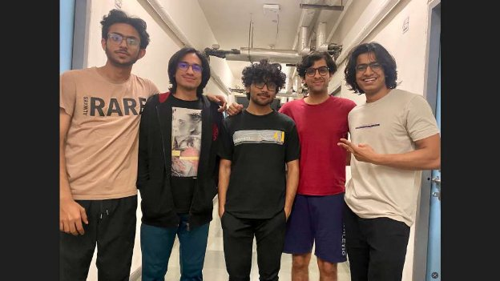
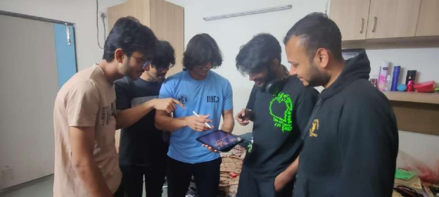
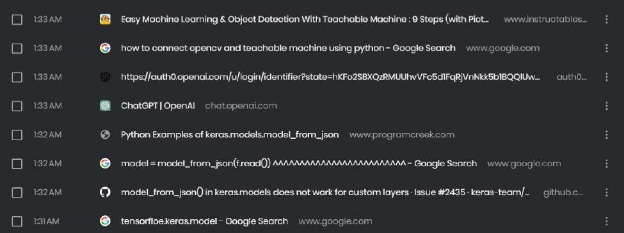
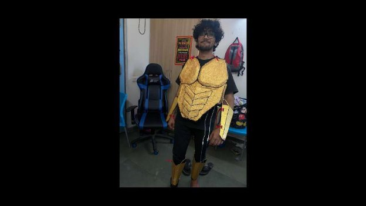

**Kinect Gladiator Controller**

- Anay Chauhan        (2021013)
  - Pranjal Bharti          (2021080)
    - Rishi pal Singh        (2021088)
    - Akarsh Gupta         (2021307)
  - Shubham Attri       (2021354)

**Prologue**

The following report documents the work of a group of five B-Tech students who undertook a comprehensive project as part of the course on Prototyping Interactive Systems. After reading the question statement, the group members had a lot of ideas in mind and were excited to bring them to life. With three members from the Computer Science and Engineering program and two members from the Computer Science and Design program, the group brought a diverse range of skills and expertise to the project.

*“Rishipal Singh, Pranjal Bharti, Anay Chauhan, Akarsh Gupta, Shubham Attri ” starting from left*

Throughout the course of the project, the group members ***worked collaboratively to develop a prototype of an interactive system*** that could solve a real-world problem. The group had several brainstorming sessions, where they discussed various ideas and concepts, and eventually settled on one that they felt had the most potential.

The group members were excited about the project from the beginning and were determined to make it a success. They regularly communicated with each other, sharing their progress, and working together to overcome any challenges that arose. Through their hard work and dedication, the group members were able to develop an innovative prototype that has the potential to make a real difference.

In the following sections of the report, the group will provide a detailed description of the project and the results that were obtained.

**Objective** 

The purpose of this report is to present an elegant and comprehensive overview of our group's ambitious project in which we sought to construct an interactive game controller utilising a wealth of concepts and technologies learned in the course of prototyping interactive systems. Our objective was to create a one-of-a-kind game controller that employed full body movements, limbs, joints, emotions, and facial expressions to heighten user engagement and captivate their attention. With the help of the Makey-Makey kit, LEDs kit, and a medley of conductive and non-conductive materials, we designed and built custom-made sensors and controllers. In addition to these materials, we delved into the Teachable Machine platform to explore machine learning and cognitive services to amplify the efficiency and interactivity of our game controller.

Our project aimed to showcase our advanced comprehension of how various technologies and tools can be fused together to create interactive and compelling systems. We strived to display our utmost creativity and originality by devising a game controller that surpasses traditional input and interfaces. Within this report, we will provide a detailed and comprehensive overview of our design process, the platforms and materials we employed, the various explorations and prototypes we crafted, and the final product. Additionally, we will examine the role of the Teachable Machine in our project and how we integrated machine learning to amplify the interactivity and efficacy of our game controller. Finally, we will highlight each team member's individual contributions and offer a clear and concise documentation and presentation of our project with photographs and write-ups.

**Introduction**

***Introduction to the concept***

The Kinetic Gladiator Controller project aims to create an innovative and interactive armour suit that is specifically designed for playing the Gladiator game. Our primary goal is to provide users with a unique and immersive gaming experience by combining various interactive devices and technologies in the armour suit.

The purpose of our project is to create an intuitive user interface that is easy to use and enhances the overall gaming experience. We wanted to design an armour suit that not only looked the part of a warrior but also incorporated advanced technology that could detect the user's movements and translate them into game commands. 

To achieve this goal, we have integrated various interactive devices and technologies into the armor suit. We used motion sensors to detect the user's movements and a vibrational motor to provide haptic feedback. These devices are controlled by an Arduino board, which is programmed to detect different types of movement and respond accordingly.

Additionally, we have used a Makey Makey input device controller to provide users with a familiar and intuitive way of interacting with the game. This device allows users to control the game using simple gestures and movements, which are detected by the motion sensors and translated into game commands.

By combining these different technologies and devices, we have created a seamless and intuitive user interface that enhances the overall gaming experience. The importance of this project lies in the fact that it demonstrates the potential of combining different technologies to create new and innovative products.

**Technicalities**

**Pose Detection**

The project utilises several cutting-edge technologies to create an interactive armour suit for a warrior. One of the crucial technologies we employed was pose detection using MediaPipe and TensorFlow.

***Pose detection is a computer vision technique that detects and tracks human body joints and estimates their positions and movements***. MediaPipe is a powerful open-source framework for building cross-platform machine learning pipelines, including pose detection models. TensorFlow is another popular open-source machine learning framework developed by Google.

`                                 `*“Using different human joint nodes to fine tune and train the model”*

To develop our pose detection model, we first collected a dataset of various body poses and movements using a camera. We then trained a machine learning model using TensorFlow, using this dataset to recognise different poses and movements of the human body.

MediaPipe provides a comprehensive set of pre-trained models and ready-to-use pipelines for various computer vision tasks, including pose detection. We used MediaPipe to create a pipeline for our pose detection model, which includes several pre- processing and post-processing steps to optimise the performance of the model.

To fine-tune our pose detection model, we wrote a Python script that loads the MediaPipe pipeline, recognises the nodes, and predicts the pose based on the input data. We also fine-tuned the model by adjusting various parameters such as the size of the input image and the confidence threshold.

*“Node Recognition”*

Pose recognition has numerous potential applications, including gaming, sports, healthcare, and rehabilitation. In our project, we used pose detection to recognise different body movements and gestures of the user to control the armour suit.

***Using Teachable Machine***

The training process involved collecting data in the form of images of the user in different poses and movements. We collected a large dataset of images for different poses and movements to train our model. We then fed this data into Teachable Machine, which used it to train a neural network model for pose recognition.

The neural network model used by Teachable Machine is a convolutional neural network (CNN) that uses multiple layers of filters to learn features from the input images. These features are then used to classify the input image into one of the pre-defined classes, which in our case were different poses and movements.

*“Testing Teachable Model”*

To fine-tune our model, we used techniques such as data augmentation and transfer learning. ***Data augmentation*** involved randomly transforming the input images to create additional training data, which helped the model to generalise better to unseen data. Transfer learning involved using a pre-trained model as a starting point for our own model, which helped us to train our model faster and with fewer data.

To evaluate the performance of our model, we used metrics such as ***accuracy, precision, recall, and F1 score.*** These metrics helped us to measure how well our model was able to recognise different poses and movements.

Overall, using ***Teachable Machine for training our pose recognition model*** was a great way to quickly and easily create a machine learning model without requiring any coding experience. The platform provided us with all the tools and resources we needed to collect and train our data, and fine-tune our model to achieve the best performance possible.

MediaPipe: A Framework for Building Perception Pipelines" by Google AI, published in IEEE Conference on Computer Vision and Pattern Recogni "Real-time Human Pose Estimation with MediaPipe" by Google AI, published in the ACM Multimedia Conference (ACM MM) 2020. 

MediaPipe documentation: https://mediapipe.dev/ 

"Teachable Machine: Easy Interactive Machine Learning for Everyone" by Daniel Smilkov et al. 

"Convolutional Neural Networks: An Overview and Application in Radiology" by Wenhao Hu et al

***Electrical Sensor***

For the input device, we used a Makey Makey board, which is a simple circuit board that can turn everyday objects into touchpads. We connected the Makey Makey board to the warrior's armour suit, allowing the user to control the armour's movements and actions using various poses and gestures.

Makey Makey basic controller setup

To process the input from the Makey Makey board, we used an Arduino board, which is a microcontroller board designed to read inputs and outputs from various electronic components. We wrote a code in Arduino's programming language to receive input signals from the Makey Makey board and convert them into commands that control the various motors and haptic sensors in the armour suit.

One of the key features of our project was the use of a haptic sensor to provide feedback to the user. We used a small  vibration motor attached to the vest of the armour to provide ***haptic feedback*** to the user when motion was detected. This allowed the user to feel the impact of their actions in real-time, enhancing the overall immersive experience. 

In addition, we used a PIR (Passive Infrared) motion sensor to detect motion in the environment. When motion was detected, it triggered the haptic sensor to vibrate the armour suit, providing an additional layer of feedback to the user. 

`          `*“PIR Sensor and Arduino”*

In addition, we used a ***PIR (Passive Infrared) motion sensor to detect motion in the environment.*** When motion was detected, it triggered the haptic sensor to vibrate the armour suit, providing an additional layer of feedback to the user.

`   `*“Assembling Haptic Feedback to armour”*

`                   `*“Testing Custom Sensor”*

`                         `*“Coding Arduino”*

Overall, the use of Makey Makey and Arduino allowed us to create a seamless and intuitive user interface for the warrior's armour suit, while the haptic sensor and motion detection added an extra level of immersion and interactivity to the user experience.

**Design Process** 

The process of designing and developing the Kinetic Gladiator Controller involved a thorough and iterative approach to ensure that the final product met the needs and desires of the users. The team employed various design thinking techniques and methods to guide the process, as well as incorporated various technologies to create an interactive and immersive experience.

The team followed an ***iterative process***, which involved continuous feedback and refinement. They started with a basic concept and iterated on it, incorporating new ideas and features while keeping the user's needs and desires in mind. The team tested various designs and collected feedback from users to make informed decisions about the product's direction. This allowed the team to rapidly test and refine the design, ultimately resulting in a more user-centric and intuitive product.

***Design Principles***

Throughout the design process, the team also followed various design principles to ensure the product was aesthetically pleasing and functional. They incorporated the principles of user-centred design, which focuses on designing products around the user's needs and abilities. The team also considered the principles of affordances and signifiers, which refer to ***the visual and functional cues that communicate how the product should be used.***

`                       `*“Brainstorming Session and using DIY like White Boards and sticky notes”*

The design process began with the ***creation of personas***, which helped the team understand the user's needs, goals, and pain points. This involved conducting user interviews and creating mental models to develop a deep understanding of the user's needs and desires. From there, the team proceeded with sketching and storyboarding to visualise and iterate on ideas.

To further refine the ideas, the team employed brainstorming and mind mapping techniques. This allowed for the exploration of various concepts and ideas to ensure that the final product met the user's needs and desires. The team also leveraged design principles such as usability, accessibility, and aesthetic appeal to create an engaging and visually appealing design.

Throughout the design process, the team focused on iteration and experimentation. They used various prototyping techniques to test and refine the design concepts. This helped to ensure that the final product would meet the user's needs and be intuitive to use.

***Team Building***

` `The team recognised the importance of teamwork and collaboration in the design process. They fostered a creative yet healthy working environment to encourage open communication and constructive feedback. The team members worked together to explore various ideas and approaches, allowing for a diverse range of perspectives and solutions.

The team also placed a strong emphasis on team building and maintaining a healthy and creative work environment. They fostered open communication and collaboration among team members, which led to a more creative and productive working environment. The team also took steps to maintain a positive work-life balance to prevent burnout and encourage creativity.

`                     `*“Team Building couldn’t have been better with a group of 5 dudes” \*not fake **Improving the design of our project***

Our first step for testing our model was to choose a suitable game that was coherent with our design and try to implement various basic commands and work our way to the more complex commands and functionalities. In order to make our testing and project implementation as realistic as possible, we chose an online gladiator action game, thus maintaining homogeneity across all test devices.

Here are some ideas which we used to improve the user experience of our Kinect gaming armour and controller project:

1. ***Reduced latency***: Latency can be a significant issue when it comes to gaming, especially in fast-paced games. By optimising the software and hardware, we were able to reduce latency and provide a much better gaming experience.
1. ***Improved accuracy:*** Inaccuracies in the tracking system and AI training model can result in missed movements, leading to frustration for the gamer. Therefore, we utilised advanced motion tracking algorithms by combining MediaPipe[, Tensorflow](https://github.com/google/mediapipe/blob/master/docs/solutions/pose.md)[.js, ](https://www.bing.com/ck/a?!&&p=e882b64cf25c99cfJmltdHM9MTY3Nzg4ODAwMCZpZ3VpZD0xZGIyZWZlYy0wOTYxLTZiM2QtMmEzOC1mZDI0MDg2NzZhNjImaW5zaWQ9NTIwMg&ptn=3&hsh=3&fclid=1db2efec-0961-6b3d-2a38-fd2408676a62&psq=tensorflowjs&u=a1aHR0cHM6Ly93d3cudGVuc29yZmxvdy5vcmcvanM&ntb=1)and [Teachable Machine. ](https://teachablemachine.withgoogle.com/)Moreover, the data samples which we took for training our AI model were quite large in size thus making sure that all edge cases were covered.
1. ***Increased interactivity:*** Once we were able to achieve the basic commands and functionalities of the game, we decided to increase user interactivity and make the gaming experience better. We decided to add haptic feedback that sets off vibrations in the chest armour plate much like the Sony Dual Sense PS5 controller.
1. ***Implement voice and facial expression commands:*** We finally decided to add voice and facial expression commands as they can add an additional layer of interactivity to the system and make it easier to control certain aspects of the game. Unfortunately, the game that we chose did not have any functions which suited such commands and therefore we dropped this idea.

circuit Diagram for PIR Sensor

`    `async function init() { 

`        `const recognizer = await createModel(); 

`        `const classLabels = recognizer.wordLabels(); // get class labels 

`        `const labelContainer = document.getElementById("label-container");         for (let i = 0; i < classLabels.length; i++) { 

`            `labelContainer.appendChild(document.createElement("div")); 

`        `} 

`        `// listen() takes two arguments: 

`        `// 1. A callback function that is invoked anytime a word is recognized. 

`        `// 2. A configuration object with adjustable fields 

`        `recognizer.listen(result => { 

`            `const scores = result.scores; // probability of prediction for each class 

`            `// render the probability scores per class 

`            `for (let i = 0; i < classLabels.length; i++) { 

`                `const classPrediction = classLabels[i] + ": " + result.scores[i].toFixed(2);                 labelContainer.childNodes[i].innerHTML = classPrediction; 

`            `} 

`        `}, { 

`            `includeSpectrogram: true, // in case listen should return result.spectrogram 

`            `probabilityThreshold: 0.75, 

`            `invokeCallbackOnNoiseAndUnknown: true, 

`            `overlapFactor: 0.50 // probably want between 0.5 and 0.75. More info in README 

`        `}); 

// Stop the recognition in 5 seconds. 

// setTimeout(() => recognizer.stopListening(), 5000); 

`                                              `“*JavaScript Function to process ML JSON Files ”*

**Exploration of other ideas**

During the brainstorming phase, the team explored various ideas for the Kinetic Gladiator Controller. Some of the ideas that were considered included a boxing simulator, a bodyweight exercise program, a Tekken-style fighting game, a Gladiator-themed game, and even a yoga trainer. Each idea presented its unique set of challenges and opportunities, particularly in terms of incorporating computer vision and motion sensing technology.

 

*“Brainstorming on possible Ideas”*

For the ***boxing simulator and bodyweight exercise program,*** the team considered incorporating a virtual personal trainer to guide the user through various exercises and provide feedback on form and technique. This would require accurate motion sensing technology to track the user's movements and provide real-time feedback.

*“Brainstorming Design Implementation”*

`    `*“Closer View of possible armour design”*

The Tekken-Style fighting game and Gladiator-themed game presented an opportunity to incorporate complex combat mechanics, requiring the user to perform specific movements to execute different attacks and manoeuvres. This would require precise motion sensing and pose detection technology to accurately recognise and interpret the user's movements.

`                 `[*“Tekken Gameplay”*](https://th.bing.com/th/id/OIP.zM18emajz9P34yIFo9CABwHaEK?pid=ImgDet&rs=1)

`                `[“Gladiator Gameplay”](https://th.bing.com/th/id/OIP.zM18emajz9P34yIFo9CABwHaEK?pid=ImgDet&rs=1)

Finally, the team also explored the idea of a yoga trainer, which would guide the user through various yoga poses and flows. This would require accurate pose detection and tracking technology to ensure that the user was executing the poses correctly.

*“Cancelling Out and converging into one approach”*

Ultimately, the team decided to focus on the ***Gladiator-themed game*,** as it offered a wide range of possibilities for incorporating motion sensing and haptic feedback technology. The team also believed that the game would be particularly appealing to the target audience, which included gamers and fitness enthusiasts.

**Challenges and Difficulties**

There were several challenges that we faced while making the Kinect gaming armour and controller using OpenCV, MediaPipe, Arduino, Makey Makey, Tensorflow, motion sensors, and Teachable AI. Despite the team's successful approach to the design process, there were still various challenges and difficulties that had to be overcome during the development of the Kinect Gladiator Controller.

One of the biggest challenges the team faced was with the initial choice of machine learning framework, TensorFlow. It became clear early on that TensorFlow was not a suitable framework for the version of the model being used, which required pose detection. As a result, the team had to retrain the model using MediaPipe, which was a significant setback.

*“Finding Solution to Bugs”*

Another challenge was finding and fixing bugs in the computer vision code. Since many team members had little to ***no prior experience with documenting computer vision code***, it was a difficult and time-consuming process.

Designing the electrical interactions of the controller was also a significant challenge for the team. While some team members had a background in computer science or engineering, others had a design background, which made it difficult to work collaboratively on this aspect of the project.

At every step of the code, the team encountered challenges that required problem-solving skills, creativity, and patience. ***Debugging and refining the code*** took much longer than anticipated and required a great deal of attention to detail.

*“Debugging Modules”*

Making the physical armour was another challenge for the team. Due to the unavailability of a laser cutter, the team had to cut the cardboard by hand, which was time-consuming and challenging. Additionally, the team had to paint the armour themselves, which required patience and attention to detail to achieve the desired aesthetic.

***One of the biggest challenges was ensuring that all the hardware components worked together smoothly.*** It was quite challenging to find the right components that are compatible with each other.

`        `*“Measuring Lengths”*

Similarly, ensuring that all the software components work together was a major issue. It is was important to ensure that the different libraries and frameworks that we were going to use were compatible with each other. A good example of this was making sure that the both the ***pip and the cv2 versions were compatible with each other.***

Calibrating the different sensors and components can be challenging, especially if you are using multiple sensors. It can be difficult to ensure that all the sensors are properly aligned and that the data they are producing is accurate. Moreover, ***training the AI model also required precise calibration to ensure no edge cases were left and using packages like the keras model required careful execution.***

Tracking the user's movements accurately can be challenging, especially if the user is moving quickly or making complex movements. It can be challenging to ensure that the system is tracking the user's movements accurately in real-time.

//                              “Arduino Code” 

// Pin Definitions 

int pirPin = 2;   // PIR sensor output connected to digital pin 2 int ledPin = 13;  // LED connected to digital pin 13 

void setup() { 

`  `// Initialize serial communication at 9600 baud   Serial.begin(9600); 

`  `// Set PIR pin as input   pinMode(pirPin, INPUT); 

`  `// Set LED pin as output   pinMode(ledPin, OUTPUT); } 

void loop() { 

`  `// Read the PIR sensor output 

`  `int pirValue = digitalRead(pirPin); 

`  `// Print the PIR sensor output value to the serial monitor   Serial.println(pirValue); 

`  `// If the PIR sensor detects motion, turn on the LED   if (pirValue == HIGH) { 

`    `digitalWrite(ledPin, HIGH); 

`  `} else { 

`    `digitalWrite(ledPin, LOW);   } 

`  `// Delay for a short time to avoid reading the sensor too quickly   delay(10); 

}

As mentioned earlier, ***latency can be a significant challenge, especially if you are using multiple sensors or complex algorithms***. It can be challenging to reduce latency and ensure that the system responds quickly to the user's movements.

Despite the challenges, the team remained persistent and determined to see the project through to completion. The team worked collaboratively to address challenges, offer support to one another, and share knowledge and skills to overcome difficulties.

`     `*“Correcting Sensitivity of PIR Module”*

`      `“*Assembling Armour”*

**Similar Work**

1. Kinect by Xbox[(\[1\]) ](https://ieeexplore.ieee.org/abstract/document/6245648): Kinect is a motion sensing input device developed by Microsoft for the Xbox 360 and Xbox One video game consoles. It uses a depth sensor and infrared projector to track the user's movements and gestures, allowing for ***interactive gameplay and control.***
1. Gesture-based control for robots[(\[2\]) : Researchers](https://www.researchgate.net/publication/351765928_Hand_Gestures_Controlled_Robot_using_Arduino) have explored using ***computer vision*** and machine learning to allow robots to recognise and interpret human gestures for control. This technology has potential applications in fields such as manufacturing, healthcare, and education.
1. Augmented reality gaming[(\[3\]): Augmented](https://www.researchgate.net/publication/359343535_Augmented_Reality_in_Gaming\(accessed) reality (AR) technology allows for virtual objects to be superimposed onto the real world. This has led to the development of AR gaming experiences that ***combine physical movements with virtual objects and challenges.***
1. Virtual reality fitness[(\[4\]): ](https://www.researchgate.net/publication/350667841_The_effects_of_virtual_reality_exercise_on_the_physical_performance_and_fatigue_of_active_young_men_in_single-stage_aerobic_and_anaerobic_running\(accessed)Virtual reality (VR) technology has been used to create immersive fitness experiences, allowing users to engage in ***virtual workouts and exercises.***
1. Wearable technology for fitness[(\[5\]): W](https://www.researchgate.net/publication/327542210_Wearable_Technology_Present_and_Future\(accessed)earable technology such as fitness trackers and smartwatches have become increasingly popular in recent years. These devices allow users to track their physical activity and monitor their health and fitness.

Here are some research papers with citation and links related to these projects and ideas:

[1]F. Soltani, F. Eskandari and S. Golestan, "Developing a Gesture-Based Game for Deaf/Mute People Using Microsoft Kinect," Ieeexplore, Mar. 5, 2017. [https://ieeexplore.ieee.org/abstract/document/6245648(accessed](https://ieeexplore.ieee.org/abstract/document/6245648) Jan. 1, 1970).

[2]G. Singh and H. Kaur, "(PDF) Hand Gestures Controlled Robot using Arduino," Researchgate, Jan. 5, 2021. [https://www.researchgate.net/publication/351765928_Hand_Gestures_Controlled_Robot_using_Arduino(accessed ](https://www.researchgate.net/publication/351765928_Hand_Gestures_Controlled_Robot_using_Arduino)Jan. 1, 1970).

[3]A. Krishna and D. Hemasri, "(PDF) Augmented Reality in Gaming," Researchgate, Mar. 5, 2022. [https://www.researchgate.net/publication/359343535_Augmented_Reality_in_Gaming(accessed](https://www.researchgate.net/publication/359343535_Augmented_Reality_in_Gaming) Jan. 1, 1970).

[4]S. Naji and E. Derakshi, "(PDF) The effects of virtual reality exercise on the physical performance and fatigue of active young men in single-stage aerobic and anaerobic running," Researchgate, Apr. 12, 2021. [https://www.researchgate.net/publication/350667841_The_effects_of_virtual_reality_exercise_on_the_physical_performance_and stage_aerobic_and_anaerobic_running(accessed Jan. 1, 1970).](https://www.researchgate.net/publication/350667841_The_effects_of_virtual_reality_exercise_on_the_physical_performance_and_fatigue_of_active_young_men_in_single-stage_aerobic_and_anaerobic_running)

[5]S. Wilson and R. M Lang, "(PDF) Wearable Technology: Present and Future," Researchgate, Jul. 12, 2018. [https://www.researchgate.net/publication/327542210_Wearable_Technology_Present_and_Future(accessed ](https://www.researchgate.net/publication/327542210_Wearable_Technology_Present_and_Future)Jan. 1, 1970).

**Novelty**

The Kinect Gladiator Controller is a highly innovative project that combines the fields of design, engineering, and computer vision to create an interactive and immersive experience. The project involves the use of a custom-built armour suit that incorporates haptic sensors and motors, allowing the user to physically feel the effects of the game. The use of computer vision technology in the form of a pose detection model further enhances the user's experience by allowing them to control the game through physical movements.

The project's novel and innovative approach lies in its ***unique combination of multiple technologies*** to create a highly interactive and immersive experience. The use of haptic feedback in the armour suit allows the user to feel the game in a way that was not possible before, while the use of ***computer vision technology*** adds a new dimension of control to the game. Furthermore, the team's approach to designing the project using design thinking techniques and methods ensured that the final product was tailored to meet the needs and desires of the user.

Overall, the Kinetic Gladiator Controller represents a significant step forward in the field of interactive gaming and highlights the potential of combining multiple technologies to create a highly engaging and immersive experience.

**Individual Contributions**

The Kinect Gladiator Controller was a project that brought together a group of individuals with different backgrounds and expertise. It was incredible to see how everyone worked together, putting their best foot forward and contributing in their unique way to make this project a reality.

Whether it was the technical know-how of coding and machine learning, the artistic flair for designing and painting the armour, or the creative input in brainstorming new ideas and approaches, every member of the team played a vital role in the success of the project.

It was heartening to see how everyone was committed to the project, working tirelessly to bring it to fruition. Each team member put in their best effort, working ***collaboratively*** and ***supporting each*** other to overcome challenges and achieve the common goal of creating an ***immersive and interactive experience.***

This project has been a great example of the power of teamwork and the importance of collaboration in achieving great things. I am grateful to have been a part of such an incredible team and We believe that our collective efforts have created something truly unique and innovative.

|S.No.|Name of the Member|Roll No./Branch|Contribution|
| - | - | - | - |
|1|Anay Chauhan|2021013|Code, Ideation, Haptic Sensor, Assembling and Testing|
|2|Pranjal Bharti|2021080|Makey Makey, Assembling, Ideation, Brainstorming and Designing of elbow shields|
|3|Rishipal Singh|2021088|Prototyping, Ideation, Putting up the armour Together, Teachable Machine AI|
|4|Akarsh Gupta|2021307|Scratch, Interview, Brainstorming|
|5|Shubham Attri|2021354|Code, Arduino, Ideation, Brainstorming , Training Model.|

*“Many Sleepless nights and debug Session later”*

**Final Product** 

After days of hard work, sleepless nights, and countless team meetings, we are proud to present the Kinetic Gladiator Controller. This innovative controller incorporates computer vision and machine learning technology to create a unique and immersive gaming experience. The team overcame numerous challenges, including software compatibility issues and the need to create a custom physical interface. However, through ***collaboration and determination***, we were able to push through these ***obstacles and create a truly novel product.*** The Kinetic Gladiator Controller represents the power of teamwork and the endless possibilities that arise when creative minds come together to pursue a common goal.

Kinect Gladiator Controller 16
